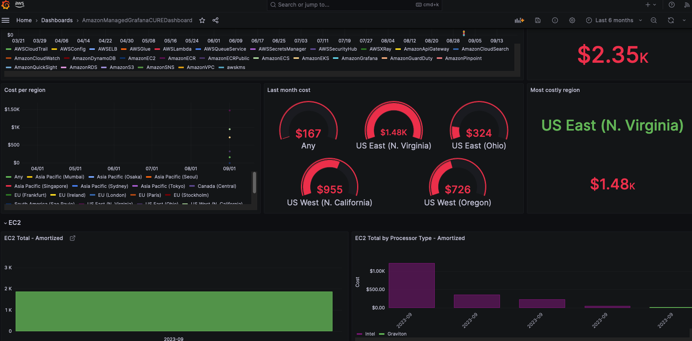

# Deploying the Solution

## Deployment using AWS CLI

``` bash
aws cloudformation create-stack \
--stack-name curcoast \
--template-body file://coast-cfn.yaml \
--parameters ParameterKey=CURDataBucketName,ParameterValue=demo-cur-report \
ParameterKey=CURReportName,ParameterValue=demo-cur-report \
ParameterKey=CreateCURReport,ParameterValue=false \
ParameterKey=CURReportPrefixName,ParameterValue=grafana \
ParameterKey=GrafanaDashboardTemplateURL,ParameterValue=https://raw.githubusercontent.com/pelgrim/observability-best-practices/main/sandbox/coast/grafana-dashboard.json  \
--capabilities CAPABILITY_NAMED_IAM
```

### Post Installation Steps
- Grafana workspaces require an identity provider (IdP) to enable users to log in to the workspace.
  - We recommend AWS IAM Identity Center.  Follow instructions in the [Grafana User Guide](https://docs.aws.amazon.com/grafana/latest/userguide/AMG-manage-users-and-groups-AMG.html) to setup user access.
  - Login with the identity to the COAST Grafana workspace URL
  - The dashboard will be automatically imported under the General folder in the Dashboards menu
  - After logging into your Amazon Managed Grafana dashboard, you will see like below:
   
